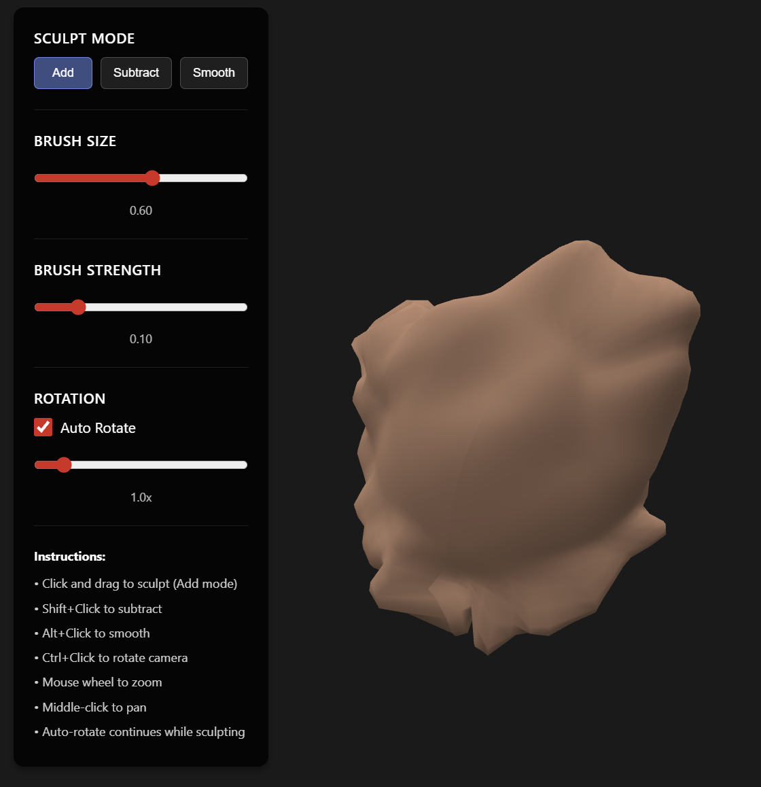

# 3D Modeler - Clay Sculpting Application



A web-based 3D modeling application that allows you to sculpt 3D models using mouse interaction. The model appears as clay and can be rotated or remain static.

## Features

- **Clay Material**: Realistic clay appearance with custom shaders
- **Mouse Sculpting**: Click and drag to sculpt the model
- **Three Sculpting Modes**:
  - **Add**: Push vertices outward (extrude)
  - **Subtract**: Push vertices inward (carve)
  - **Smooth**: Average nearby vertices
- **Adjustable Brush**: Control brush size and strength
- **Rotation Control**: Toggle auto-rotation or manually rotate with mouse
- **Camera Controls**: Zoom, pan, and rotate the camera

## Prerequisites

- Docker
- Docker Compose

No other prerequisites needed! Everything runs in containers.

## Getting Started

1. **Start the application:**
   ```bash
   docker-compose up
   ```

2. **Access the application:**
   - Open your browser and navigate to `http://localhost:3000`

3. **Stop the application:**
   - Press `Ctrl+C` in the terminal, or
   - Run `docker-compose down`

## Usage

### Sculpting
- **Left-click and drag** on the model to sculpt
- Select a mode (Add/Subtract/Smooth) from the toolbar
- Adjust brush size and strength using the sliders

### Camera Controls
- **Right-click and drag**: Rotate the camera
- **Mouse wheel**: Zoom in/out
- **Middle-click and drag**: Pan the camera
- **Auto Rotate**: Toggle automatic rotation of the model

### Toolbar
The toolbar on the left side provides:
- Sculpt mode selection
- Brush size control (0.1 - 1.0)
- Brush strength control (0.01 - 0.5)
- Auto-rotation toggle and speed control

## Technology Stack

- **React** - UI framework
- **Three.js** - 3D graphics library
- **React Three Fiber** - React renderer for Three.js
- **@react-three/drei** - Useful helpers for R3F
- **Vite** - Build tool and dev server
- **Docker** - Containerization
- **nginx** - Web server (production)

## Project Structure

```
3dmodeler/
├── docker-compose.yml      # Docker Compose configuration
├── README.md               # This file
├── PLAN.md                 # Detailed implementation plan
└── frontend/
    ├── Dockerfile          # Production Dockerfile
    ├── Dockerfile.dev      # Development Dockerfile
    ├── package.json        # Dependencies
    ├── vite.config.js      # Vite configuration
    ├── nginx.conf          # nginx configuration
    └── src/
        ├── main.jsx        # Entry point
        ├── App.jsx         # Main app component
        ├── components/     # React components
        ├── shaders/        # GLSL shaders
        ├── utils/          # Utility functions
        └── styles/         # CSS styles
```

## Development

The application runs in development mode by default with hot module replacement. Any changes to the code will automatically reload in the browser.

## Production Build

To build for production:

1. Update `docker-compose.yml` to use `Dockerfile` instead of `Dockerfile.dev`
2. Run `docker-compose up --build`

The production build uses nginx to serve the optimized static files.

## Troubleshooting

- **Port already in use**: Change the port in `docker-compose.yml` (e.g., `"3001:3000"`)
- **Container won't start**: Make sure Docker is running and ports are available
- **No 3D model visible**: Check browser console for errors, ensure WebGL is supported

## Future Enhancements

- Save/load models
- Export to OBJ/STL format
- Multiple brush types
- Undo/redo functionality
- Texture painting
- Model import

## License

MIT

